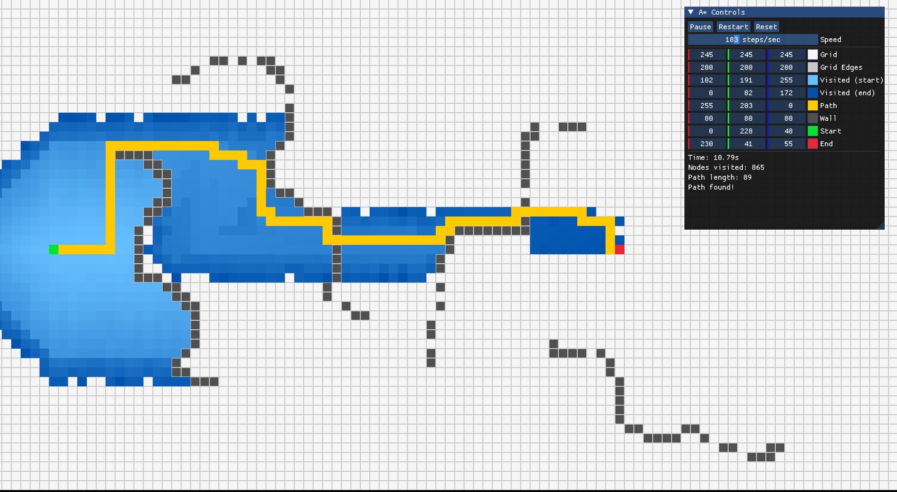

# Pathfinder

A* , Dijkstra pathfinder alogrithm visualization written in C++ using `raylib`, `ImGui`.


`VERSION 3.1`

## Features
- Visualize A* and Dijkstra 
- Compare A* and Dijstra
- ImGuI menu to control visuals and algorithm mechanics.
- Menu also has info about : Nodes visisted, Time taken.
- Abstract class to handle more pathfinder algorithms : BFS , DFS


## Gallery 

----


----


----




----


## Setup

You need `raylib` on your system (use vcpkg or something)

```powershell
# 1. Clone the repo
git clone <>


# 2. Go inside directory and call cmake
cmake -B out\

# 3. Files will be build in 'out' directory
# 4 Call your build systerm or : 
cmake -build out --config release

```


## Usage

- Left mouse click to place walls
- Click at wall to erase it
- S + LMB to place starting cell
- E + LMB to place ending cell
- Space to start the visualization
- Other control options are on Imgui menu


## AI Policy

AI usage for code generation and documentation is forbidden for this project.

> Shahi ( *prefers natural stupidity over artifical intelligence*)


## TODO
- Optimize heuristics for A*
- maybe add sound