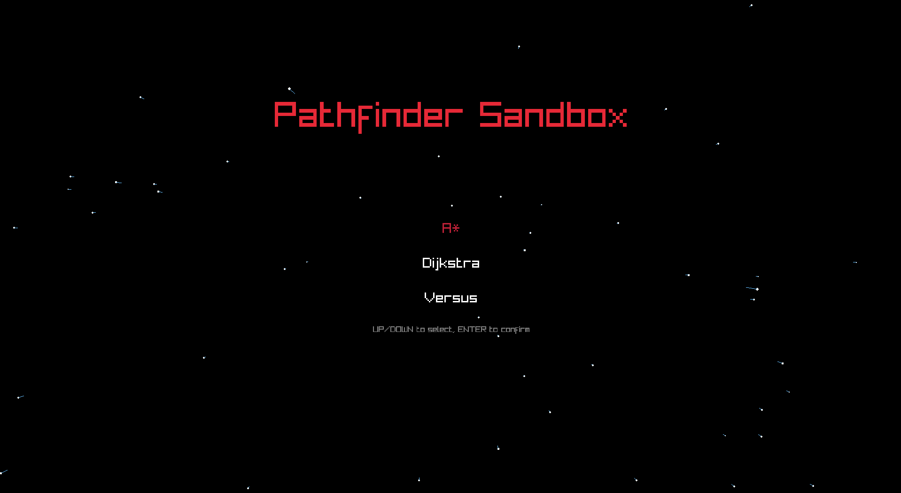
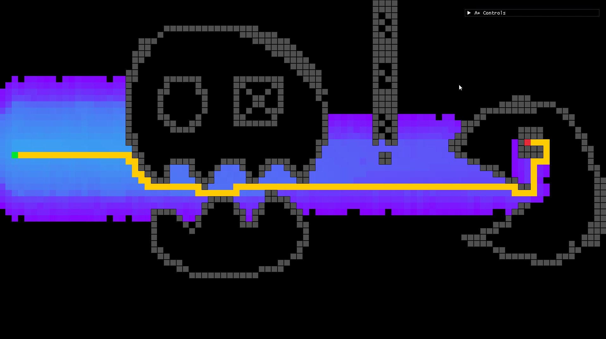
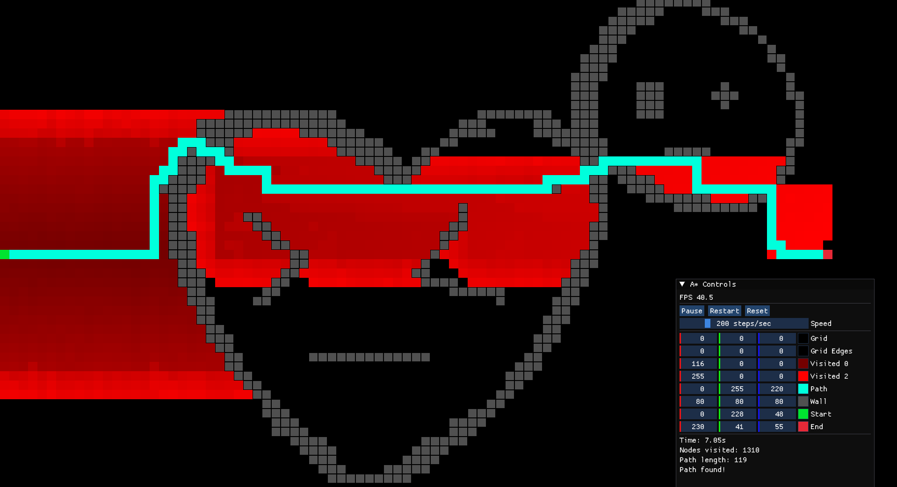
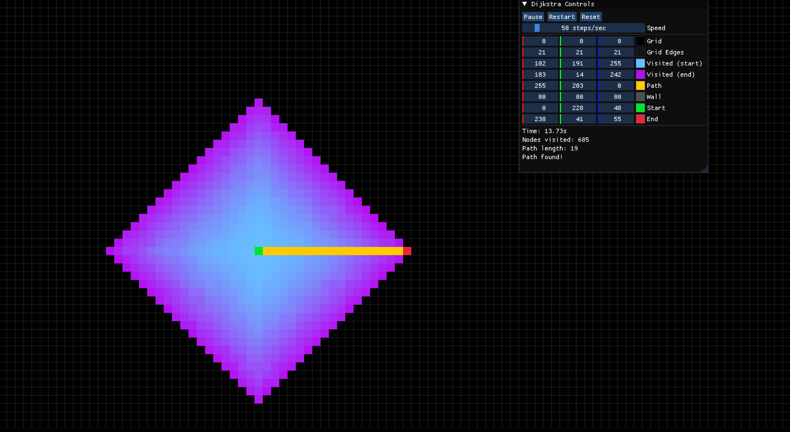
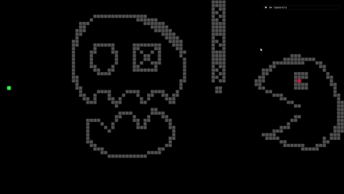
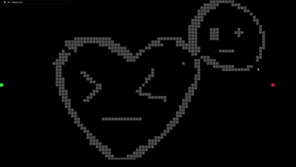

# Pathfinder

A* , Dijkstra pathfinder alogrithm visualization written in C++ using `raylib`, `ImGui`.


`VERSION 3.6`

## Features
- Visualize A* and Dijkstra 
- Compare A* and Dijstra
- ImGuI menu to control visuals and algorithm mechanics.
- Menu also has info about : Nodes visisted, Time taken.
- Abstract class to handle more pathfinder algorithms : BFS , DFS


## Gallery 

----



----



----



----



----





----

## Setup

You need `raylib` on your system (use vcpkg or something)

```powershell
# 1. Clone the repo
git clone https://github.com/ArcShahi/PathFinder.git


# 2. Go inside directory and call cmake
cmake -B out\

# 3. Files will be build in 'out' directory
# 4 Call your build systerm or : 
cmake -build out --config release

```

If you had used `vcpkg` to install `raylib` and using Visual Studio 2026 : 

Add  `CMakePresets.json` to root directory: 
```json
    {
	"version": 6,
	"configurePresets": [
		{
			"name": "default",
			"generator": "Ninja",
			"binaryDir": "${sourceDir}/out",
			"cacheVariables": {
				"CMAKE_TOOLCHAIN_FILE": "path/to/your/vcpkg.cmake"
			}
		}
	]
}
```

Check CMake toolchain file path : `vcpkg integrate install`.

If using `vcpkg` with any other build system them just simply pass :

```powershell
cmake -B out\ -"-DCMAKE_TOOLCHAIN_FILE=path/to/your/vcpkg.cmake"
```
when generating build files.


## AI Policy

AI usage for code generation and documentation is forbidden for this project.

> Shahi ( *prefers natural stupidity over artifical intelligence*)


## TODO
- Optimize heuristics for A*
- maybe add sound